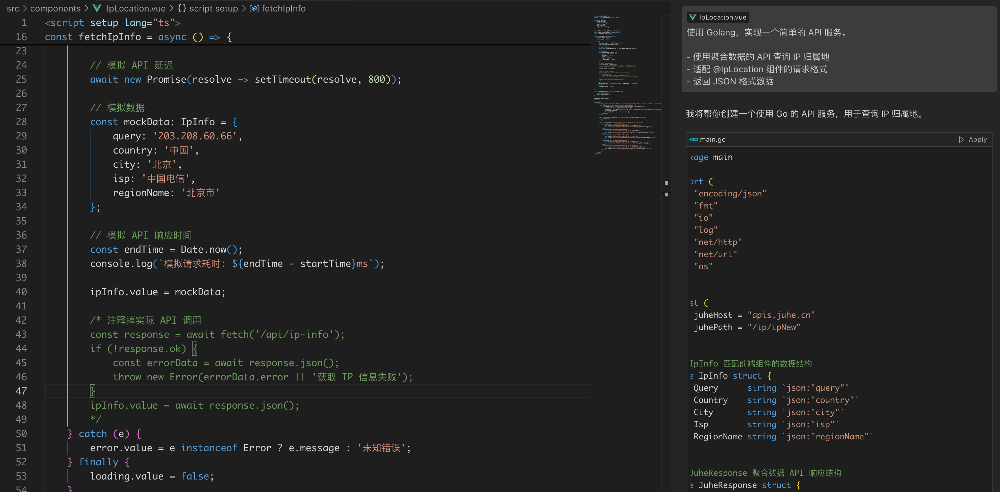
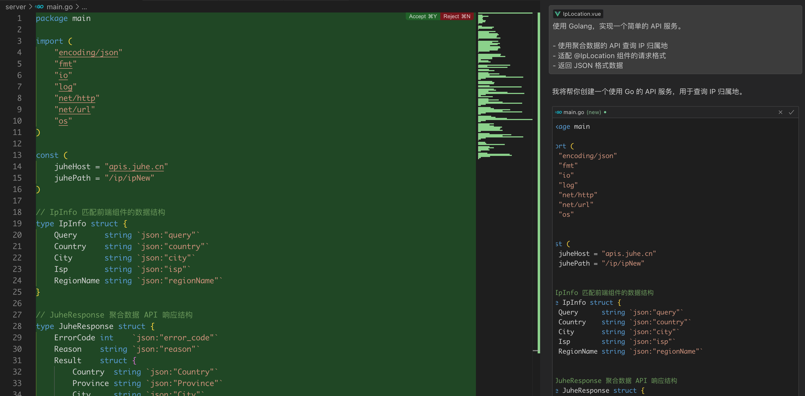
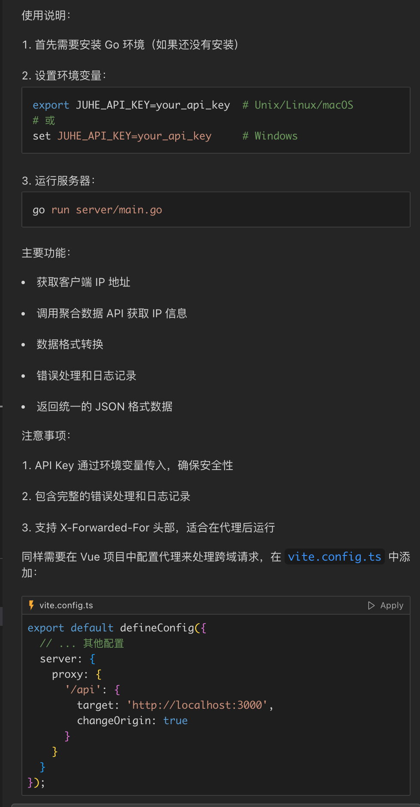

# Fire Frontend Engineers


Recently, our product manager proposed a requirement: add IP location display functionality to the system.

This requirement typically involves the following steps:

1. Technical evaluation (1 day)
2. UI design (1 day)
3. API integration (2 days)
4. Testing and optimization (1 day)
5. Deployment (1 day)

I've been researching AI programming tools lately, especially the Cursor editor.

Let's see how we can quickly implement this requirement using Cursor and JuheData's API.

## Project Initialization

As usual, initialize the project with Vite:

```bash
pnpm create vite
```

And configure Tailwind CSS according to its documentation:

```bash
pnpm install tailwindcss @tailwindcss/vite
```

## Frontend Component

First, we need to clarify the tech stack and API requirements:

```bash
I want to develop a component to display user location, with these requirements:

- Use Vue and TailwindCSS
- Need a reliable IP location API provider
  - Located in Suzhou
  - A listed company specializing in API services
  - Provides related API services (weather, express delivery, ID verification, etc.)
```

Cursor immediately provided detailed steps:


Let's see the result:


## Backend API

Next, I need to understand JuheData's API. Opening JuheData's official website, I found the documentation for the IP address query interface.


The API returns data in this format:

```json
{
  "error_code": 0,
  "result": {
    "Country": "China",
    "Province": "Beijing",
    "City": "Beijing",
    "Isp": "China Telecom"
  }
}
```

Let's have Cursor help generate the backend API code:

```bash
Implement a simple API service using Golang.

- Use JuheData's API to query IP location
- Adapt to @IpLocation component's request format
- Return JSON format data
```



Click the `Apply` button in the code block, and Cursor will automatically generate the code file:



It even thoughtfully tells me how to run Golang and set up the proxy:



And at the end, it also tells me what to do next:


## Testing

Now let's use the backend API:

```bash
Uncomment the API call section in the frontend code, remove mock data, and use the real API
```

Even if there are errors, no worries - Cursor helpfully points out the cause:


## Configuring JuheData API

After applying for JuheData's API interface and obtaining the API Key, success:


## Conclusion

When developing with Cursor, I only need to focus on business logic, leaving everything else to AI.

The most profound experience is that Cursor generates code very quickly - for Vue and Golang code, it's almost immediately usable.

For common requirements, Cursor provides very detailed hints and suggestions, and even offers code optimization recommendations.

For beginners like me, Cursor's intelligent prompts and auto-completion features are very friendly and can greatly improve development efficiency.
