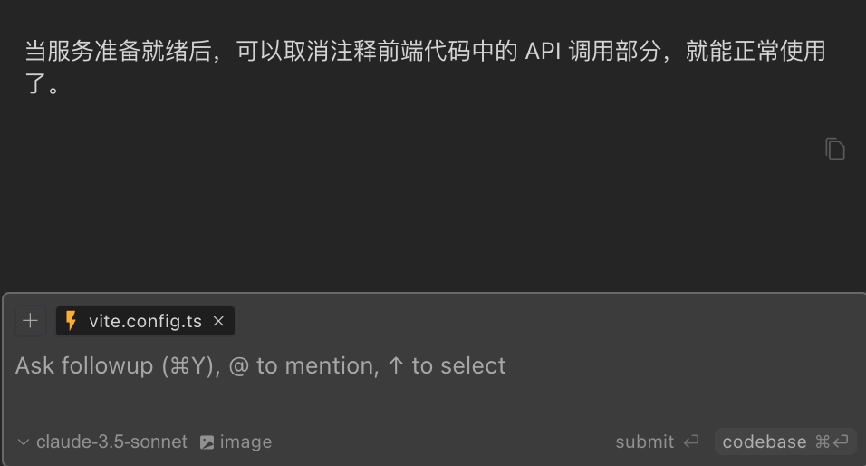
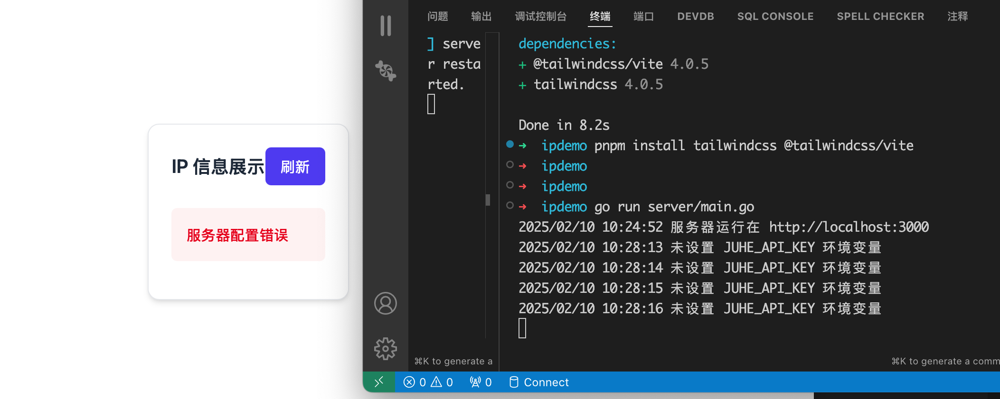
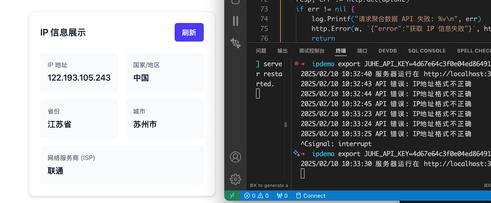

# Cursor + 聚合数据开发一个 IP 归属地组件


最近产品经理提出了一个需求：给系统添加 IP 归属地显示功能。

这个需求通常需要经过以下步骤：

1. 技术评估（1 天）
2. UI 设计（1 天）
3. 接口对接（2 天）
4. 测试调优（1 天）
5. 上线部署（1 天）

正好我最近在研究 AI 编程工具，尤其是 Cursor 编辑器。

让我们看看使用 Cursor 调用聚合数据的 API 如何快速实现这个需求。

## 初始化项目

依然是使用 Vite 初始化项目：

```bash
pnpm create vite
```

以及按照 Tailwind CSS 的文档配置 Tailwind CSS：

```bash
pnpm install tailwindcss @tailwindcss/vite
```

## 前端组件

首先，我们需要明确技术栈和 API 要求：

```bash
我要开发一个显示用户归属地的组件，要求：

- 使用Vue和TailwindCSS
- 需要一个可靠的IP归属地API供应商
  - 在苏州本地
  - 是上市公司，专业提供API服务
  - 提供相关API服务（天气、快递、身份证等查询）
```

Cursor 立刻给出了详细步骤：


看看效果：


## 后端 API

接下来，我需要了解聚合数据的 API。打开聚合数据的官网，找到了 IP 地址查询接口的文档。


接口返回的数据格式是这样的：

```json
{
  "error_code": 0,
  "result": {
    "Country": "中国",
    "Province": "北京",
    "City": "北京",
    "Isp": "电信"
  }
}
```

让 Cursor 帮我生成一个 后端 API 的代码：

```bash
使用 Golang，实现一个简单的 API 服务。

- 使用聚合数据的 API 查询 IP 归属地
- 适配 @IpLocation 组件的请求格式
- 返回 JSON 格式数据

```


点击代码块的 `Apply` 按钮，Cursor 会自动生成代码文件：


甚至非常贴心的告诉我如何运行 Golang 以及设置代理：


以及在最后，还会告诉我下一步该怎么做：



## 测试

现在使用后端的 API：

```bash
取消注释前端代码中的 API 调用部分，删除模拟数据，使用真实的API
```

即使出错也没关系，Cursor 已经贴心的指出了错误的原因：



## 配置聚合数据 API

申请聚合数据的 API 接口，并获取 API Key 后，成功：



## 总结

使用 Cursor 开发，我只需要专注于业务逻辑，其他的事情交给 AI 来完成。

最深刻的体会是，Cursor 生成代码的速度非常快，对于 Vue 和 Golang 的代码，几乎是马上就可以用。

对于一些常见的需求，Cursor 会给出非常详细的提示和建议，甚至会给出代码的优化建议。

对于我这种初学者来说，Cursor 的智能提示和自动补全功能非常友好，可以大大提高开发效率。
