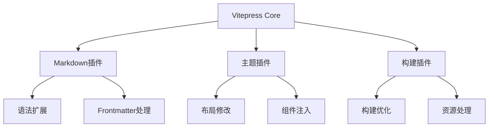

# 插件系统完全指南

## 插件架构原理


## 1. 基础插件开发
### 插件结构模板
```javascript:plugins/my-plugin.js
export default (options = {}) => {
  return {
    name: 'vitepress-plugin-demo',
    
    // 扩展配置
    config(config) {
      return {
        head: [
          ['script', { src: options.cdnUrl }]
        ]
      }
    },
    
    // 增强Vue应用
    enhanceApp({ app, router }) {
      app.mixin({
        mounted() {
          console.log('组件挂载!')
        }
      })
    }
  }
}
```

### 使用自定义插件
```javascript:config.js
import myPlugin from './plugins/my-plugin'

export default defineConfig({
  vite: {
    plugins: [
      myPlugin({
        cdnUrl: 'https://example.com/sdk.js'
      })
    ]
  }
})
```

## 2. Markdown扩展插件
### 自定义容器
```javascript:plugins/md-containers.js
import markdownItContainer from 'markdown-it-container'

export default () => ({
  name: 'md-containers',
  extendsMarkdown: (md) => {
    md.use(markdownItContainer, 'warning', {
      validate: (params) => params.trim() === 'warning',
      render: (tokens, idx) => tokens[idx].nesting === 1 ? 
        '<div class="warning">⚠️' : '</div>'
    })
  }
})
```

### 代码块增强
```javascript:plugins/code-demo.js
export default () => ({
  name: 'code-demo',
  transform(code, id) {
    if (!id.endsWith('.md')) return
    return code.replace(
      /```(\w+)\s*demo([\s\S]*?)```/g,
      '<Demo><template #demo>$2</template></Demo>'
    )
  }
})
```

## 3. 主题集成插件
### 自动注册组件
```javascript:plugins/auto-components.js
import { glob } from 'glob'

export default (options) => ({
  name: 'auto-components',
  async enhanceApp({ app }) {
    const files = await glob('components/**/*.vue')
    for (const file of files) {
      const name = path.basename(file, '.vue')
      app.component(name, defineAsyncComponent(() => import(file)))
    }
  }
})
```

### SEO增强插件
```javascript:plugins/seo-optimize.js
export default (options) => ({
  name: 'seo-optimize',
  transformHead(context) {
    return [
      ['meta', { name: 'keywords', content: context.pageData.frontmatter.tags }],
      ['meta', { property: 'og:title', content: context.pageData.title }]
    ]
  }
})
```

## 4. 构建优化插件
### 图片压缩
```javascript:plugins/image-minify.js
import viteImagemin from 'vite-plugin-imagemin'

export default () => ({
  name: 'image-minify',
  configureServer(server) {
    server.middlewares.use((req, res, next) => {
      if (req.url?.endsWith('.jpg')) {
        // 处理图片请求
      }
      next()
    })
  },
  config() {
    return {
      vite: {
        plugins: [
          viteImagemin({
            gifsicle: { optimizationLevel: 3 }
          })
        ]
      }
    }
  }
})
```

## 插件发布规范
1. 命名约定：`vitepress-plugin-<name>`
2. 类型声明：提供TypeScript类型定义
3. 文档说明：包含使用示例和配置选项
4. 版本对齐：指定支持的Vitepress版本

## 调试技巧
```bash
# 使用本地插件
import myPlugin from '../plugins/my-plugin'

# 开启调试模式
DEBUG=vite:plugin:* npm run docs:dev

# 性能分析
vite --profile
``` 